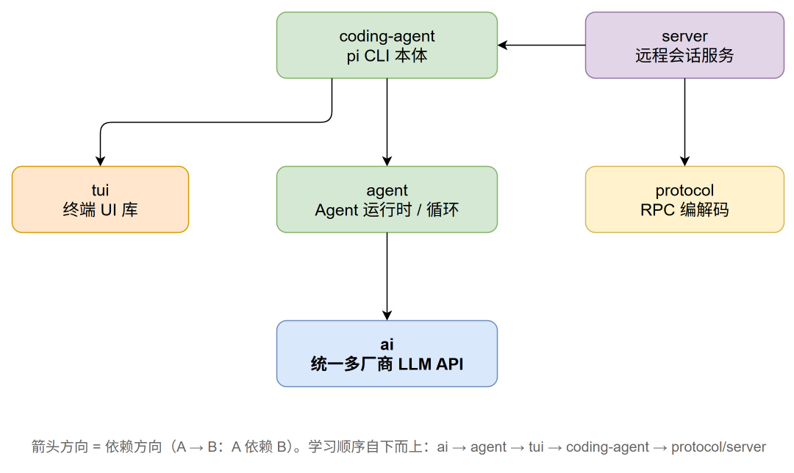

# pi 源码学习教程

面向已有 agent 开发基础的读者，讲解 pi 各 package 的核心架构思想。

## 阅读顺序

按包依赖关系从底向上（与根目录 `LEARNING.md` 的阶段规划一致）：

## 目录

### 第零章 · basics —— 前置知识（选读）

| 节 | 文档                                                           | 一句话                                            |
| -- | -------------------------------------------------------------- | ------------------------------------------------- |
| 1  | [basics/01-js-async-essence.md](basics/01-js-async-essence.md) | 看透 JS 异步：Promise、Generator、async/await 同源 |

### 第一章 · packages/ai —— 统一多提供商 LLM API

| 节 | 文档                                                             | 一句话                                      |
| -- | ---------------------------------------------------------------- | ------------------------------------------- |
| 0  | [ai/00-overview.md](ai/00-overview.md)                           | 30+ 厂商如何被压成一个接口：Api ≠ Provider |
| 1  | [ai/01-types-and-stream.md](ai/01-types-and-stream.md)           | 地基：统一消息类型与流式事件协议            |
| 2  | [ai/02-models-providers-auth.md](ai/02-models-providers-auth.md) | Models 注册表、Provider 工厂与认证解析链    |
| 3  | [ai/03-api-adapters.md](ai/03-api-adapters.md)                   | 协议适配器解剖与 compat 标志系统            |
| 4  | [ai/04-robustness.md](ai/04-robustness.md)                       | 健壮性工程：错误即数据、重试、溢出检测      |

### 第二章 · packages/agent —— Agent 运行时与核心循环

| 节 | 文档                                                               | 一句话                                           |
| -- | ------------------------------------------------------------------ | ------------------------------------------------ |
| 0  | [agent/00-overview.md](agent/00-overview.md)                       | 三层洋葱：纯函数循环 → 状态封装 → harness 装配 |
| 1  | [agent/01-agent-loop.md](agent/01-agent-loop.md)                   | 核心循环：轮边界收敛插话、截断保护与并行时序     |
| 2  | [agent/02-agent-class.md](agent/02-agent-class.md)                 | Agent 类：快照隔离、事件归约与订阅者屏障         |
| 3  | [agent/03-harness-and-session.md](agent/03-harness-and-session.md) | harness 与会话树：追加日志、每轮重建、技能加载   |
| 4  | [agent/04-compaction.md](agent/04-compaction.md)                   | 压缩：阈值、切点、增量摘要与分支摘要             |

### 第三章 · packages/tui —— 终端差分渲染

| 节 | 文档                                                                 | 一句话                                                 |
| -- | -------------------------------------------------------------------- | ------------------------------------------------------ |
| 0  | [tui/00-overview.md](tui/00-overview.md)                             | UI 是行的数组，渲染是数组的 diff                       |
| 1  | [tui/01-differential-rendering.md](tui/01-differential-rendering.md) | 不闪 = 节流 + 行 diff + 同步输出，三层各挡一类闪烁     |
| 2  | [tui/02-input-pipeline.md](tui/02-input-pipeline.md)                 | 输入三次升维：字节 → 完整序列 → 语义按键 → 组件动作 |

### 第四章 · packages/coding-agent —— 组装成产品

| 节 | 文档                                                                                         | 一句话                                                 |
| -- | -------------------------------------------------------------------------------------------- | ------------------------------------------------------ |
| 0  | [coding-agent/00-overview.md](coding-agent/00-overview.md)                                   | 一个核心对象 AgentSession，四种模式只是 I/O 皮肤       |
| 1  | [coding-agent/01-agent-session.md](coding-agent/01-agent-session.md)                         | 事件枢纽的三路分发、自动压缩与基于消息的重试           |
| 2  | [coding-agent/02-tools.md](coding-agent/02-tools.md)                                         | 工具是 LLM 与现实的边界：模糊匹配、截断、落盘          |
| 3  | [coding-agent/03-extensions.md](coding-agent/03-extensions.md)                               | 扩展 = 库层插槽 + 运行时 TS 加载 + 信任边界            |
| 4  | [coding-agent/04-interactive-mode.md](coding-agent/04-interactive-mode.md)                   | 把事件的时间序列投影成组件的空间结构                   |
| 5  | [coding-agent/05-system-prompt-and-context.md](coding-agent/05-system-prompt-and-context.md) | 系统提示词是四个来源的实时投影，AGENTS.md 链近者优先   |
| 6  | [coding-agent/06-model-runtime-auth.md](coding-agent/06-model-runtime-auth.md)               | 认证落地（选读）：带锁的 auth.json 与 5 分钟新鲜度余量 |

### 第五章 · packages/protocol + server —— RPC 与远程会话

| 节 | 文档                                                             | 一句话                                             |
| -- | ---------------------------------------------------------------- | -------------------------------------------------- |
| 0  | [protocol-server/00-overview.md](protocol-server/00-overview.md) | 三层递进：可编程 → 可托管 → 可远程，一会话一进程 |
| 1  | [protocol-server/01-rpc-mode.md](protocol-server/01-rpc-mode.md) | JSONL 管道上的命令/响应/事件，UI 请求反向穿透      |
| 2  | [protocol-server/02-server.md](protocol-server/02-server.md)     | supervisor 只当管家不当翻译：进程生死簿与事件广播  |
| 3  | [protocol-server/03-protocol.md](protocol-server/03-protocol.md) | 面向不可信网络：长度前缀帧 + CBOR + 快照权威模型   |
