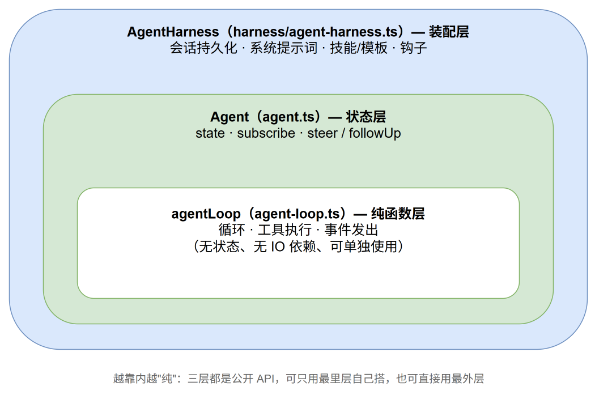
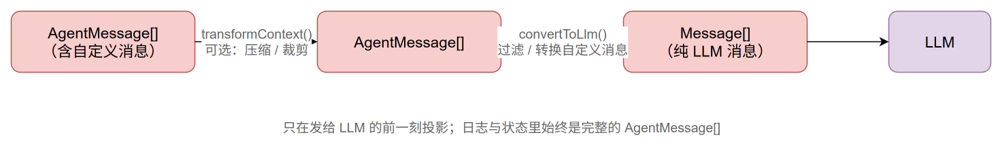

# 第二章 · 0 packages/agent 总览：从一次 LLM 调用到一个会干活的 agent

> 源码：`packages/agent/src/`，npm 包名 `@earendil-works/pi-agent-core`
> 位置：承接第一章。`pi-ai` 给了我们"调用一次 LLM 并拿到统一事件流"的能力，本章解决下一个问题：怎么把"一次调用"变成"一个持续干活、可打断、可持久化的 agent"。第四章的 coding-agent 就构建在本章的 harness 之上。

## 1. 它解决什么问题

有了第一章的 `streamSimple`，写一个"聊天机器人"只要十行。但 agent 不是聊天机器人。agent 的定义特征是：**模型可以要求执行工具，工具结果回填后模型接着干，直到它认为做完了**。

朴素方案是手写一个 while 循环：

```typescript
while (true) {
  const msg = await callLLM(messages);
  const toolCalls = msg.content.filter(c => c.type === "toolCall");
  if (toolCalls.length === 0) break;
  for (const call of toolCalls) messages.push(await runTool(call));
}
```

这个循环能跑，但离能用还差得远。逐条数一数它没解决的问题：

- 用户中途想插一句"别改那个文件了"，怎么办？（插话）
- 工具跑了三分钟，UI 拿什么渲染进度？（事件）
- 模型输出到一半被 token 上限截断，工具调用参数不完整，执行吗？（截断保护）
- 三个工具调用，能不能并行跑？并行了事件顺序怎么保证？（并发时序）
- 进程重启后对话怎么恢复？用户想回退到十轮之前重来，怎么办？（持久化与分支）
- 对话太长塞不进上下文窗口了，怎么办？（压缩）

`pi-agent-core` 就是把这些问题逐个解决后的产物。它的分层像洋葱，从里到外：



上面的图中，越靠内的层越"纯"：`agentLoop` 只是一个 async 函数，吃进消息数组吐出事件流，自己不持有任何状态；`Agent` 给它加上可变状态和订阅机制；`AgentHarness` 再加上会话文件、系统提示词组装这些"应用该操心的事"。三层都是公开 API——你可以只用最里层自己搭，也可以直接用最外层。

## 2. 读懂本包的钥匙：AgentMessage ≠ Message

第一章说过，LLM 只认三种消息：`user`、`assistant`、`toolResult`。但一个真实应用的对话流里还有别的东西——通知、压缩摘要、bash 执行记录。pi 的选择是引入一个更宽的类型：

```typescript
// src/types.ts
export type AgentMessage = Message | CustomAgentMessages[keyof CustomAgentMessages];
```

上面代码中，`AgentMessage` 是 LLM 消息与"自定义消息"的联合。`CustomAgentMessages` 默认是空接口，应用通过 TypeScript 的声明合并（declaration merging）往里注入自己的消息类型。整个 agent 循环、会话存储、事件系统操作的都是 `AgentMessage`；只在**发给 LLM 的前一刻**，用一个 `convertToLlm` 函数把它压回纯 `Message[]`：



你可能会问：为什么不直接在消息数组里只放 LLM 消息，别的东西另存一份？因为**顺序就是信息**。"用户在第 3 轮后按了压缩"这件事必须记在第 3 轮后面的位置上；分开存两个数组，回放和分支切换时就要做痛苦的对齐。一个数组、临发送前投影，是更简单的模型。

## 3. 本包的两条契约

读本章代码时会反复撞见两条注释里写死的契约，先点明：

**契约一：回调不许抛异常。** `convertToLlm`、`transformContext`、`getApiKey`、`getSteeringMessages`……几乎每个配置回调的 JSDoc 都写着同一句话：

> Contract: must not throw or reject. Return a safe fallback value instead.

这是第一章"错误即数据"契约的延续：循环内部没有为回调准备 try/catch 通道，回调一抛，事件序列就断在半截。把"不许抛"写成文档契约而不是到处包 try/catch，是 pi 有意的取舍——包住每个回调意味着吞掉编程错误。

**契约二：工具用异常报错，循环把异常变数据。** 与回调相反，工具的 `execute` 被明确要求**失败就 throw**。循环 catch 住后把它转成 `isError: true` 的 toolResult 消息喂回模型，让模型自我修正。同一个包里两种相反的错误策略，分界线很清楚：**框架回调的异常是 bug，工具的异常是数据**。

## 4. 一个具体数字感受分层

`agent-loop.ts` 约 800 行，`agent.ts` 约 570 行，而 `harness/` 目录合计超过 4000 行。核心循环其实很小，**复杂度大头在"装配"**：会话树、压缩、技能加载、系统提示词。这正是本章的阅读顺序依据——先用两节读透小而关键的内核，再用两节读装配层。

## 本章路线

| 节 | 内容 | 对应源码 |
|---|------|---------|
| 1 | 核心循环：双层 while、插话、截断保护、并行工具 | `agent-loop.ts` |
| 2 | Agent 类：状态归约、订阅屏障、消息队列 | `agent.ts`、`types.ts` |
| 3 | harness 与会话：树状日志、每轮重建、技能与模板 | `harness/agent-harness.ts`、`harness/session/` |
| 4 | 压缩：阈值、切点、增量摘要、分支摘要 | `harness/compaction/` |

## 动手实验

跑一遍官方 README 的最小 agent，感受三层中最外层的用法（不花钱，用 faux provider）：

```typescript
// scratch-agent.ts —— npx tsx scratch-agent.ts
import { Agent } from "@earendil-works/pi-agent-core";
import { createModels, fauxProvider, fauxAssistantMessage } from "@earendil-works/pi-ai";

const faux = fauxProvider();
const models = createModels();
models.setProvider(faux.provider);
faux.setResponses([fauxAssistantMessage("我是一个 agent。")]);

const agent = new Agent({ streamFn: models.streamSimple.bind(models) });
agent.state.model = faux.getModel();
agent.subscribe((ev) => console.log(ev.type));
await agent.prompt("你好");
```

预期输出一串事件类型：`agent_start → turn_start → message_start → message_end →（assistant 的 start/update…/end）→ turn_end → agent_end`。这串事件就是第 1 节的主角。
